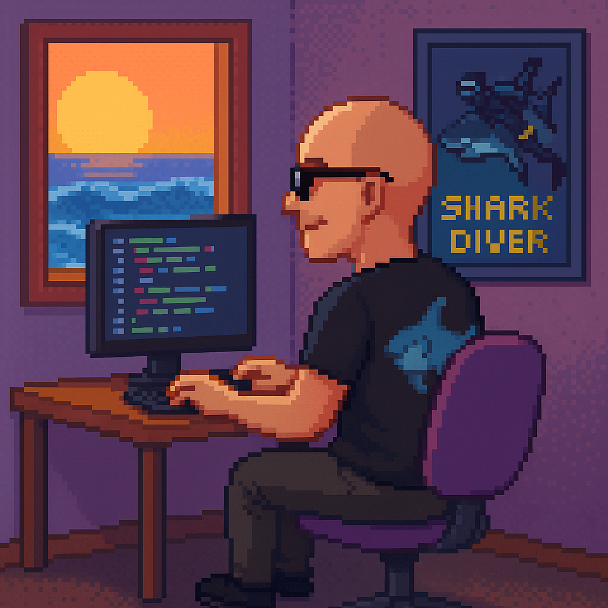

### Hey there! 👋 I'm Marcelo Nogueira


<table>
  <tr>
    <td width="70%">
      I'm a passionate software developer who loves building things that matter — one line of code at a time.  
      Currently working on cool projects with Node.js, TypeScript, GraphQL and Prisma, while always learning and experimenting with new tech.
    </td>
    <td align="center" width="30%">
      
    </td>
  </tr>
</table>

---

### 🛠 Tech Stack

```javascript
const celo = {
    pronouns: "He" | "Him",
    code: ["TypeScript", "Javascript", "Python"],
    askMeAbout: ["web dev", "app dev", "tech trends"],
    technologies: {
        frontEnd: {
            js: ["React", "Next.js", "Vuejs"],
            css: ["Sass", "Tailwind", "Bootstrap"],
            uiLibraries: ["Material UI", "Ant Design", "Chakra UI"],
        },
        backEnd: {
            js: ["Node", "Express", "NestJS"],
            python: ["Flask", "fastapi"],
        },
        devOps: ["Docker🐳", "CI/CD", "Nginx", "GitHub Actions"],
        cloudServices: ["gpc", "IBM Cloud"],
        databases: ["PostgreSQL", "MongoDB", "SQLite", "Firebase Realtime DB", "redis"],
        misc: ["Socket.IO", "REST APIs", "WebSockets", "Cloud Functions", "GraphQl"],
        generativeAI: ["GPT", "Google Ai Studio"],
    },
    architecture: {
        frontEnd: ["SPA", "SSR"],
        backEnd: ["microservices", "monolithic", "serverless"],
        devOps: ["CloudFormation", "Serverless Framework"],
        databases: ["Relational", "NoSQL", "In-memory"],
    },
    currentFocus: "Studying for dev interviews and improving my English",
    funFact: "I can debug faster with a coffee in hand!"
};
```

 <em><b>I love connecting with different people</b> so if you want to say <b>hi, I'll be happy to meet you more!</b> 😊</em>

---
<!--START_SECTION:waka-->

```rust
From: 02 September 2019 - To: 16 May 2025

Total Time: 542 hrs 54 mins

TypeScript   285 hrs 45 mins >>>>>>>>>>>>>------------   52.20 %
SCSS         104 hrs 39 mins >>>>>--------------------   19.12 %
HTML         61 hrs 35 mins  >>>----------------------   11.25 %
PHP          49 hrs 54 mins  >>-----------------------   09.12 %
JavaScript   21 hrs 28 mins  >------------------------   03.92 %
Other        4 hrs 29 mins   -------------------------   00.82 %
```

<!--END_SECTION:waka-->

---

### 🎯 Goals
🧹 Write clean, maintainable code.
🧠 Learn new tech deeply, not just superficially.
👥 Share knowledge and support the dev community.
🌎 Travel the world while coding remotely.

---

### 📄 Resume

Wanna work together or check out what I've been up to?  
**[📎 View My Resume]('./resumes/marcelo_nogueira_en.pdf)**

**[📎 View My Resume-pt]('./resumes/marcelo_nogueira_pt.pdf)**

---

### 🌍 Let's Connect

I'm always up for new opportunities, interesting chats, or building something fun.  
Feel free to reach out!

[](https://www.linkedin.com/in/marcelo-nogueira-silva/)
[](mailto:marcelo.nogueirasilva@outlook.com)
[](https://github.com/locemarn)

---

### 📊 GitHub Statistics

<p align="">
  
  
  
</p>


✨ Bonus
 <em>I love connecting with different people — if you say hi, I’ll be happy to meet you! 😊</em> ```